# Demo Project of mobile tests for <a target="_blank" href="https://github.com/wikimedia/apps-android-wikipedia">Wikipedia</a> app

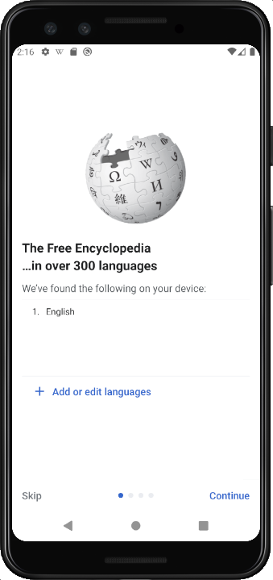

### Tech Stack:
<code></code>
<code></code>
<code></code>
<code></code>
<code></code>
<code></code>
<code></code>
<code></code>
<code></code>
<code></code>
<code></code>
<code></code>
<code></code>

### Test cases:
- Search:
  - Search results render for valid search query
  - Search for invalid query doesn't return results
- Article:
  - Article successfully opens
- Onboarding:
  - Onboarding screens have correct titles
- Language switch:
  - Language is successfully added to the list of languages

### For local launch:

1. Create a new directory on your local machine

```bash
mkdir mobile_wiki_diploma
cd mobile_wiki_diploma
```

2. Clone the repository

```bash
git clone https://github.com/AngPawl/mobile_wiki_diploma
```

3. Create and fill in `.env` file based on env.example in the root project directory

4. Install and activate virtual environment

```bash
python -m venv .venv
```
  - For Linux/macOs:
  ```bash
  source .venv/bin/activate
  ```
  - For Windows:
  ```bash
  source venv/scripts/activate
  ```

5. Install Poetry package

```bash
pip install poetry
```

6. Install dependencies:

```bash
poetry install
```

7. Launch tests from command line

```bash
pytest .
```

## Remote run is executed on <a target="_blank" href="https://www.browserstack.com/">Browserstack</a> server via <a target="_blank" href="https://jenkins.autotests.cloud/job/007-ang_pawl-mobile_wiki_diploma/">Jenkins</a> job

### For remote launch:
- Open <a target="_blank" href="https://jenkins.autotests.cloud/job/007-ang_pawl-mobile_wiki_diploma/">Jenkins</a> job
- Click on Build with Parameters button
- Choose parameters and click on Build

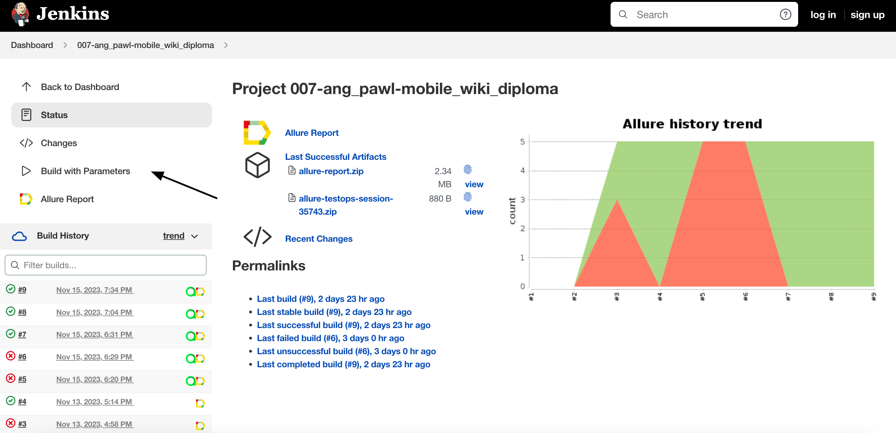
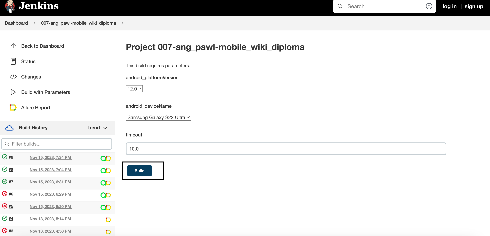

### You may set the following parameters:
- android_platformVersion (tests will run on this specific platform version): 12.0, 13.0, 11.0
- android_deviceName (device name): Samsung Galaxy S22 Ultra, Google Pixel 7 Pro, OnePlus 9
- timeout: 10s on default

### *After the test run is completed you may check result info and related graphics on Allure Report page:*

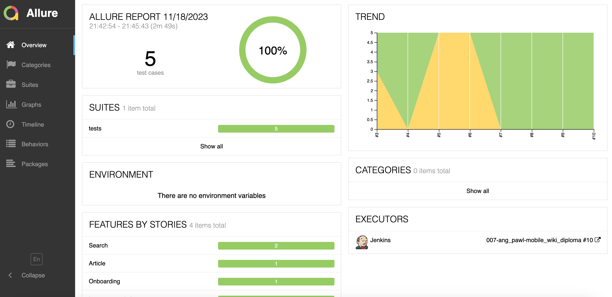

### *You may also look through detailed result info for each test case:*

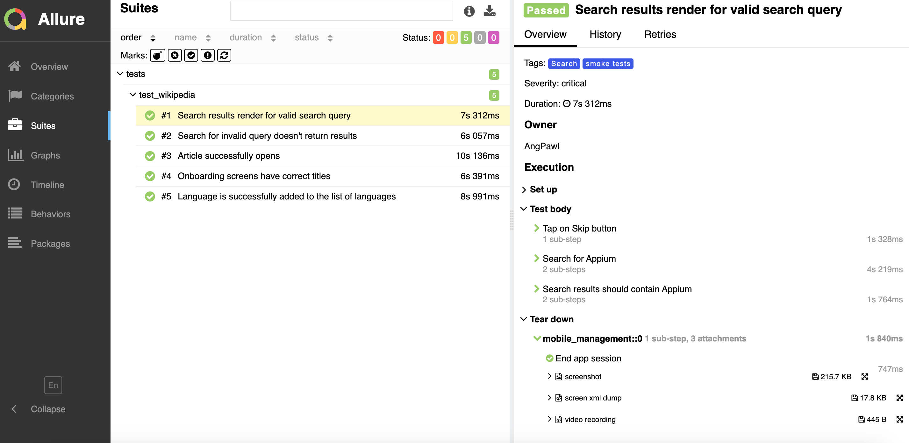

## General test run statistics, including manual tests, are stored on <a target="_blank" href="https://allure.autotests.cloud/project/3788/dashboards">Allure TestOps</a> platform

### *Main Allure TestOps dashboard:*

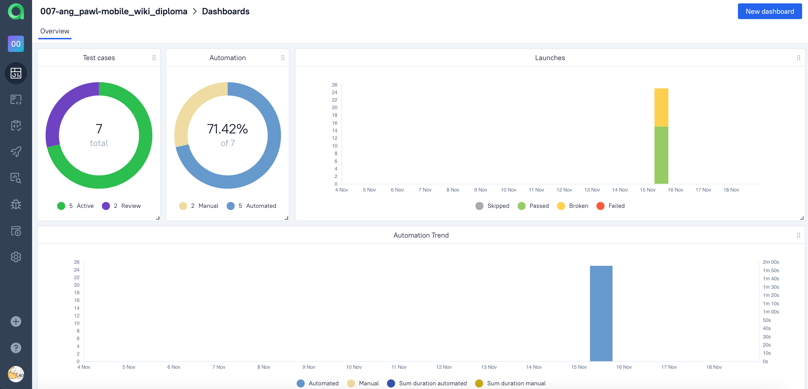

### *Full list of automated and manual test cases:*

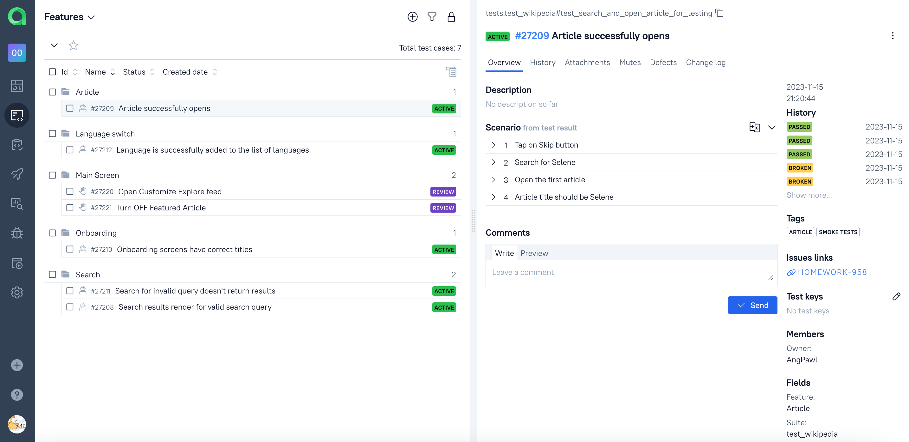

### *Automated and manual tests launch logs:*

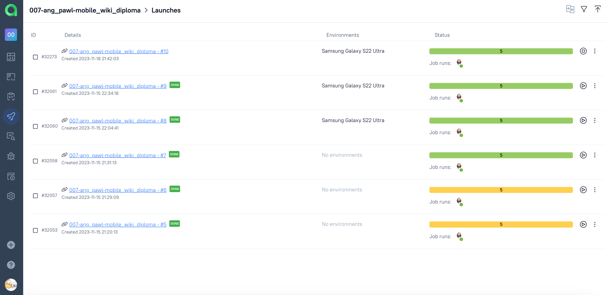

## Test cases and run results are integrated with <a target="_blank" href="https://jira.autotests.cloud/browse/HOMEWORK-958">Atlassian Jira</a> and linked to the corresponding task

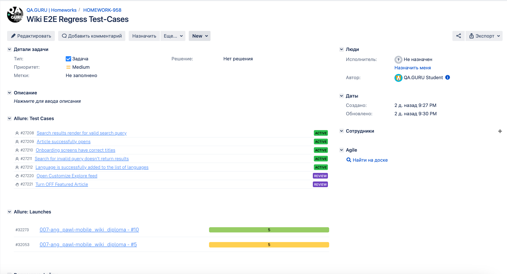

## Additionally, Telegram integration is set for immediate test result notifications:
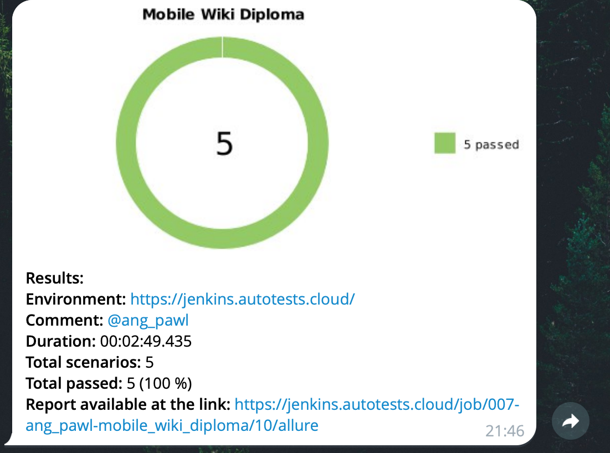

### There is a short video sample of a test case run from <a target="_blank" href="https://www.browserstack.com/">Browserstack</a> server
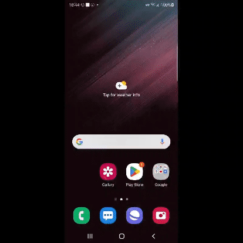

